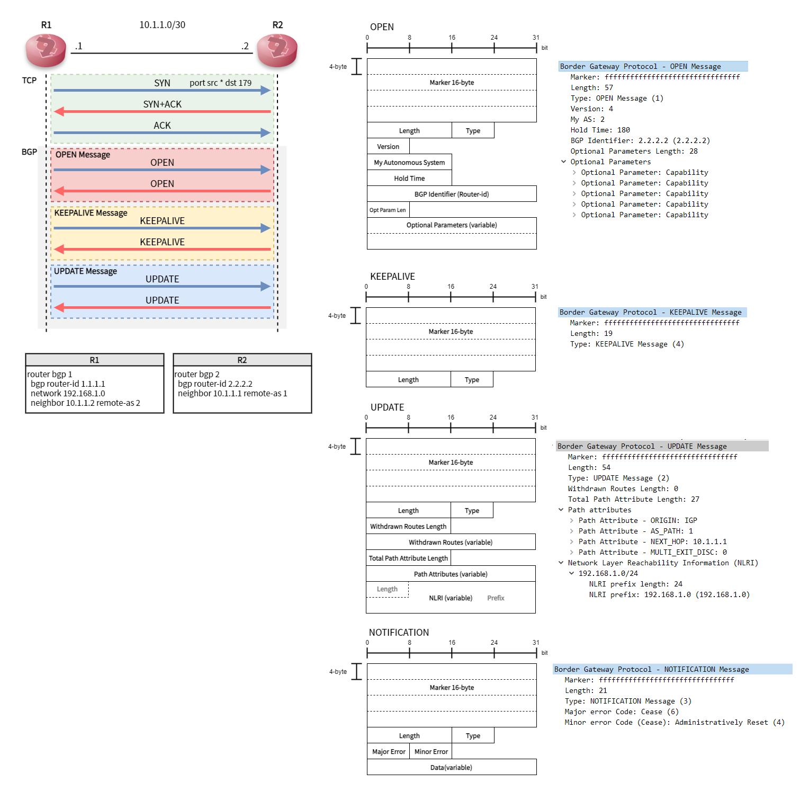
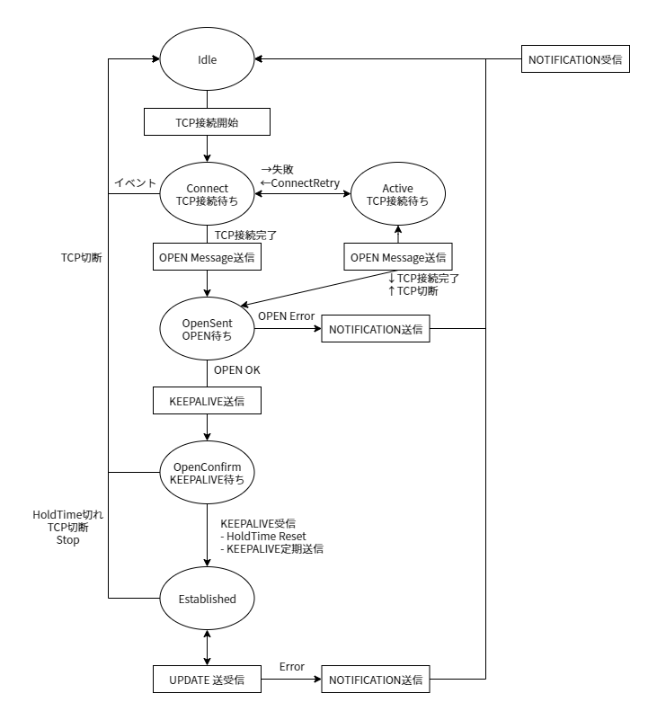

# bgp_explorer
## 目的
seccampをきっかけとしてBGPを完全に理解するためにPythonでBGPを創り上げる。

## 実行
config.yamlを調整した後下記コマンド
> #cd bgp  
> // レスポンダーモード  
> #python main.py sv  
> // イニシエーターモード  
> #python main.py cl
> // ip routeとcsvの初期化
> #python main.py init
## わかりやすくまとめた図??
### BGPとは

### BGP状態遷移
